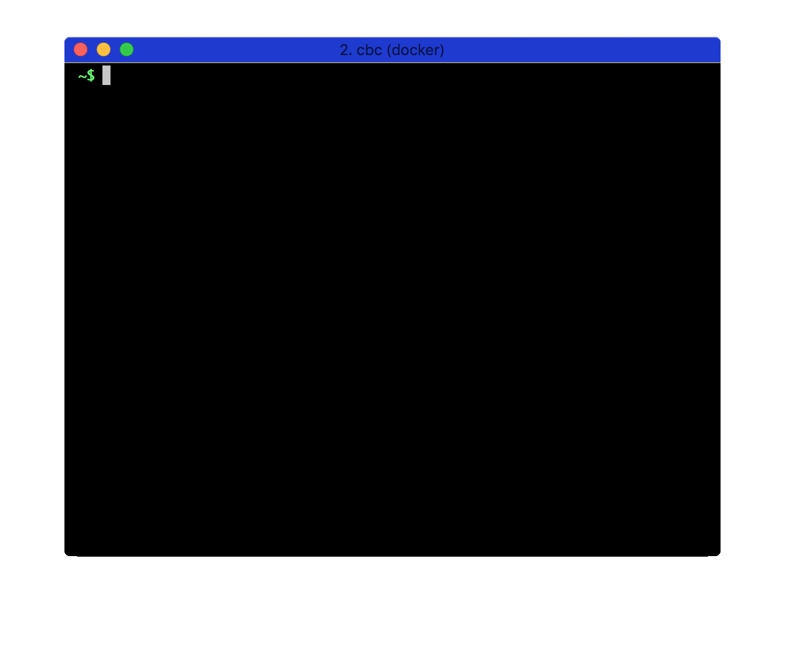

# Install Watson/Python API

**Requirements**: You need to have completed the [Anaconda installation tutorial](3-anaconda_install.md).

## Objectives & Outlines

By the end of this lesson, you will be abel to:
- **import the Watson package into Python**

Description of this lesson:
- **Type**: step-by-step tutorial
- **Estimated time for completion**: 20 mins.


## Rationale

In order to access and use functionalities of the Bluemix platform in your own python code, you need to install a python module.
This module, called `watson-developer-cloud`, has been developed by IBM for python developers. It is an <abbr title="Application Programming Interface">API</abbr> to the Bluemix platform.

> "In computer programming, an application programming interface (API) is a set of subroutine definitions, protocols, and tools for building application software. In general terms, it is a set of clearly defined methods of communication between various software components." [Wikipedia](https://en.wikipedia.org/wiki/Application_programming_interface)


## \#1 Installing the Python Watson API on Anaconda

1. Open a <dfn title="in Windows, use Anaconda Prompt">terminal</dfn>, get into the [`cbc` environment](anaconda_install.md) by typing:

  ```bash
  source activate cbc
  ```

  *Note: if you work in Windows just type `activate cbc` (discard `source`) in the Anaconda Prompt or launch `Anaconda Prompt (cbc)` from the menu.*.


2. Install the python module called `watson_developer_cloud` by typing:

  ```bash
  pip install --upgrade watson-developer-cloud
  ```

  It should display some installation messages (see screencast below).

3. Also, we will use the [module `python-dotenv`](https://github.com/theskumar/python-dotenv) to manage credentials to the Watson API. Type:

    ```bash
    pip install --upgrade python-dotenv
    ```

4. Finally, we will ue the module `pytest` to run test cases on your code before submitting it. Type:

    ```bash
    pip install --upgrade pytest
    ```


## Check your work 💪

You can test your installation by running `ipython`. In your terminal type:

  ```bash
  ipython
  ```

  and then, within `ipython`, type:
  ```python
  import watson_developer_cloud
  ```

  If you have **no error message**, you're done !

  
